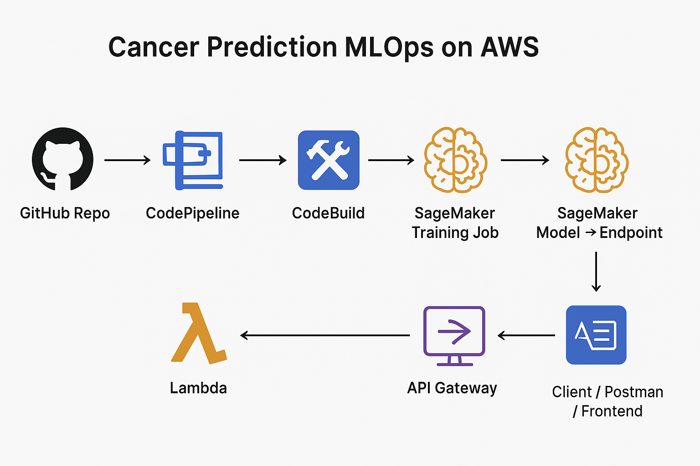

# cancer-prediction-mlops-aws-sagemaker
# Cancer Prediction MLOps on AWS

This repository implements a full MLOps workflow:

- Data stored in S3
- PyTorch model trained in SageMaker
- Model deployed as SageMaker real-time endpoint
- Endpoint accessed via Lambda + API Gateway
- CI/CD with GitHub + CodePipeline + CodeBuild

## 🚀 Features

- Data stored in S3
- PyTorch model trained in SageMaker
- Model deployed as a SageMaker Endpoint
- Endpoint accessed via Lambda + API Gateway
- CI/CD pipeline with GitHub + CodePipeline + CodeBuild
- Fully automated retraining & redeployment

## 🏁 Getting Started

### Prerequisites
1. AWS account with permissions for:
   - S3
   - SageMaker
   - Lambda
   - API Gateway
   - IAM
   - CodeBuild
   - CodePipeline
2. AWS CLI installed and configured
3. Python 3.7+ and pip

### Setup
1. Clone the repository:
   ```bash
   git clone https://github.com/yourusername/cancer-prediction-mlops-aws-sagemaker.git
   cd cancer-prediction-mlops-aws-sagemaker
   ```

2. Install dependencies:
   ```bash
   pip install -r requirements.txt
   ```

3. Create S3 bucket for data and model artifacts:
   ```bash
   aws s3 mb s3://cancer-prediction-mlops-demo
   ```

### Running Locally for Development
1. Prepare the data:
   ```bash
   mkdir -p data
   python src/prepare_data.py
   ```

2. Upload data to S3:
   ```bash
   aws s3 cp data/breast_cancer.csv s3://cancer-prediction-mlops-demo/data/
   ```

3. Run the SageMaker training job locally for testing:
   ```bash
   python src/train_estimator.py --mode local
   ```

### Deploying to AWS
1. Run full training job on SageMaker:
   ```bash
   python src/train_estimator.py --mode sagemaker
   ```

2. Deploy model to a SageMaker endpoint:
   ```bash
   python src/deploy_model.py --model-name cancer-prediction-model
   ```

3. Test the endpoint directly:
   ```bash
   python src/test_endpoint.py
   ```

### Setting up CI/CD Pipeline
1. Push your code to GitHub
2. Follow these steps in AWS Console:
   - Create a CodePipeline connected to your GitHub repository
   - Configure CodeBuild to use buildspec.yml
   - Set up necessary IAM roles with permissions
   - Add SageMaker deployment stage to pipeline

Once set up, every push to the main branch will trigger the pipeline.

## 📁 Folder Structure
```
cancer-prediction-mlops-aws-sagemaker/
│
├─ src/                  # Training scripts
│   ├─ train.py           # PyTorch training script
│   ├─ train_estimator.py # SageMaker training job launcher
│   └─ utils.py           # Helper functions (optional)
│
├─ lambda/
│   └─ lambda_function.py # Lambda function to call SageMaker endpoint
│
├─ requirements.txt      # Python dependencies
├─ buildspec.yml         # CodeBuild CI/CD configuration
└─ README.md             # This file
```

## 📊 Workflow Visualization
```
   GitHub Repo
        │
        ▼
   CodePipeline
        │
        ▼
   CodeBuild
        │
        ▼
SageMaker Training Job
        │
        ▼
SageMaker Model → Endpoint
        │
        ▼
     Lambda
        │
        ▼
  API Gateway → Client / Postman / Frontend
```



Every push to GitHub triggers retraining and redeployment.

SageMaker handles training and stores models in S3.

Lambda + API Gateway provide a simple HTTP API for predictions.

## ⚙️ How to Use
### 1️⃣ Push Code to GitHub

- Make changes to src/train.py or other scripts
- Push to main branch → triggers CI/CD

### 2️⃣ CodePipeline + CodeBuild

- Installs dependencies from requirements.txt
- Runs train_estimator.py to train model on SageMaker
- Saves model artifacts to S3

### 3️⃣ Deploy Model

- Endpoint name set in train_estimator.py or Lambda
- Lambda function calls the SageMaker endpoint
- API Gateway exposes /predict HTTP route

### 4️⃣ Test API
```bash
curl -X POST https://<api-gateway-url>/predict \
-H "Content-Type: application/json" \
-d '{"features": [0.1,0.2,0.3,...]}'
```

Response:
```json
{"prediction": 1.0}
```

## 🧩 Dependencies

Install Python dependencies:
```bash
pip install -r requirements.txt
```

- torch
- scikit-learn
- pandas
- boto3
- sagemaker
- numpy

## 📈 Example Visualizations (Optional)

Training Loss Curve (inside notebook):
```python
import matplotlib.pyplot as plt

plt.plot(epochs, loss_values)
plt.xlabel('Epochs')
plt.ylabel('Loss')
plt.title('Training Loss')
plt.show()
```

Prediction Histogram:
```python
plt.hist(predictions)
plt.xlabel('Prediction')
plt.ylabel('Frequency')
plt.title('Predicted Classes Distribution')
plt.show()
```

## 🔑 Notes

- Make sure your IAM roles have access to S3, SageMaker, Lambda, and CodeBuild.
- Keep the GitHub repo as single source of truth for code and CI/CD pipeline.
- You can extend this project by:
  - Adding model validation checks
  - Monitoring data drift
  - Creating a frontend dashboard for predictions

